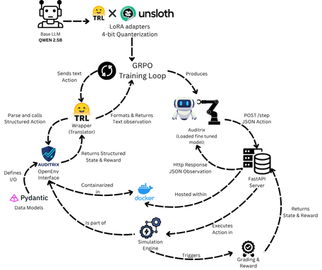
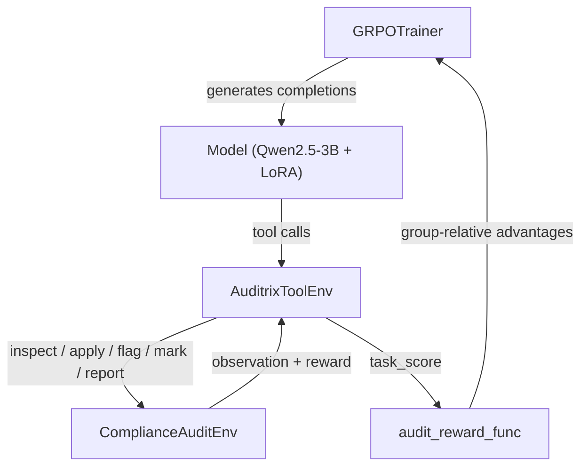

# OpenEnv — Interactive Compliance Audit Environment

> **A real-world AI agent environment for performing iterative compliance audits on structured organisational records.**


### Architecture Diagram



OpenEnv Compatible | HF Space Live | Docker Ready | Tests Passing

---

## Project Links

- GitHub Repository: https://github.com/Kowshikv07/Auditrix
- HF Space: https://huggingface.co/spaces/Kowshik147/Auditrix
- HF Space README: https://huggingface.co/spaces/Kowshik147/Auditrix/blob/main/README.md
- Training Notebook: https://www.kaggle.com/code/kowshikv14/auditrix?scriptVersionId=314553752
- Presentation: https://canva.link/507528ayd2q90oc

---

## Hackathon Theme Alignment

Auditrix was designed as a powerhouse solver for two major hackathon themes:

**1. Theme #2: Long-Horizon Planning (Scale AI Bonus - HR & IT Workflows)**
- Our environment explicitly tackles the **Scale AI Bonus** by providing a long-horizon, multi-step workflow in a business/HR setting (Employee Records, Salaries, Timesheets, Background Checks).
- The agent must orchestrate dozens of interactions (up to 80 steps for hard tasks, **400 steps** for the streaming task), track state over extended trajectories, and deal with highly delayed rewards (the terminal score at the exact end of an audit).
- The **`streaming_long_horizon` task** (350 records, 400 steps, sparse terminal-focused reward with low-magnitude shaping) directly tests the sub-theme requirement: *"agents must decompose goals, track state over extended trajectories, and push beyond shallow next-token reasoning."*
- The **`prioritize_rules` action** forces the agent to commit to a multi-step strategy *before* seeing any rewards — a true long-horizon planning signal.
- The **Mercor Bonus** is satisfied by the `streaming_long_horizon` grader: terminal reward scales with output tokens because longer, more complete reports (with `audit_confidence` sections, full `flagged_violations` lists, and `recommendations`) score higher, creating a natural token-output reward gradient.

**2. Theme #3.1: World Modeling (Professional Tasks)**
- Directly tests an agent's ability to orchestrate tool-based professional workflows without exploiting shortcuts. 
- Features a highly complex **Anti-Exploit Engine** that catches and penalizes recursive loops or hallucinated spam actions, forcing genuine reasoning.
- Explores world model belief updates through a **Dynamic Event Engine** that injects system outages and policy changes mid-simulation.

---

## Overview

The **Compliance Audit Environment** simulates the real-world process of an HR or regulatory compliance officer auditing employee records against a set of policy rules. An AI agent must:

1. **Inspect** each organisational record to reveal its fields.
2. **Apply** compliance rules to detect potential violations.
3. **Flag** confirmed violations and **mark** compliant records.
4. **Generate** a final audit report to close the episode.

The agent is evaluated on how accurately it identifies violations (recall), avoids false positives (precision), achieves full dataset coverage, and completes the audit efficiently.

This domain is directly applicable to training and evaluating agents for:
- Regulatory automation (SOX, GDPR, FLSA)
- HR compliance tooling
- Auditable AI decision-making
- Finance and payroll control auditing

### Dynamic Audit Environment

| Feature | Description |
|---|---|
| **Dynamic Events** | `POLICY_UPDATE`, `SYSTEM_OUTAGE`, `RECORD_AMENDMENT` injected per `(task_id, seed)` |
| **Structured Explainability** | `evaluate_with_evidence()` returns `reason_codes` + field-level evidence per rule |
| **Audit Confidence Report** | `generate_report` accepts an `audit_confidence` section with evidence coverage ratio |
| **Anti-Exploit Grading** | Loop detection (sliding window), report consistency check, coverage floor |
| **Extreme Task** | `regulatory_storm_audit` — 25 records, all 11 rules, 6 simultaneous dynamic events |
| **Streaming Long-Horizon** | `streaming_long_horizon` — 350 records, 400 steps, sparse reward with strong terminal signal, `prioritize_rules` strategy action |
| **Token-Scaled Reward** | Report quality grader rewards richer structured reports → terminal reward scales with output quality (Mercor Bonus) |
| **Variance Reporting** | `--seeds N` runs each task N times; reports mean±std + failure mode taxonomy |

---

## Action Space

All actions are submitted as JSON via `POST /step`.

| `action_type` | `record_id` | `rule_id` | `rule_priority_order` | Description |
|---|---|---|---|---|
| `inspect_record` | required | — | — | Reveal a record's fields. Required before any audit action. |
| `apply_rule` | required | required | — | Run a compliance rule on an inspected record. Returns +0.2 if a violation is found. |
| `request_evidence` | required | required | — | Gather detailed evidence for a rule (useful for 'warning' verdicts). Free action. |
| `flag_violation` | required | required | — | Officially flag a (record, rule) violation. +0.5 if correct, −0.3 if false positive. |
| `retract_flag` | required | required | — | Retract a previously-flagged violation if new evidence changes your view. |
| `mark_compliant` | required | — | — | Declare a record fully compliant. +0.05 if right, −0.10 if violations were missed. |
| `prioritize_rules` | — | — | required | Declare rule priority order (highest-severity first). Free action. Call once per episode. |
| `generate_report` | — | — | — | Submit the final audit report and end the episode (higher terminal reward). |
| `finish` | — | — | — | End the episode without a report (lower terminal reward). |

**Example actions:**
```json
{"action_type": "request_evidence", "record_id": "E001", "rule_id": "R3"}
```
```json
{"action_type": "prioritize_rules", "rule_priority_order": ["R9", "R4", "R6", "R8", "R1", "R5", "R11", "R7", "R3", "R2", "R10"]}
```

---

## Observation Space

Every `step()` and `reset()` returns an `AuditObservation`:

```json
{
  "task_id": "finance_sox_audit",
  "task_title": "Finance Department SOX Compliance Audit",
  "objective": "...",
  "available_rules": [
    {"rule_id": "R3", "description": "Salary outside role range", "condition": "salary < role_min or salary > role_max"},
    {"rule_id": "R6", "description": "Background check missing for sensitive role", "condition": "..."},
    {"rule_id": "R7", "description": "Unapproved overtime (>48 h/week)", "condition": "hours > 48 and overtime_approved != True"},
    {"rule_id": "R8", "description": "Missing annual compliance training", "condition": "status == 'active' and compliance_training != True"}
  ],
  "step_index": 4,
  "max_steps": 80,
  "remaining_steps": 76,
  "visible_records": [
    {
      "record_id": "F001",
      "fields": {"id": 101, "name": "Richard Holt", "role": "finance_manager", "hours": 52, "overtime_approved": false, ...},
      "inspected": true,
      "marked_compliant": false,
      "flags": ["R7"]
    }
  ],
  "checked_records": ["F001"],
  "violations_found": [
    {"record_id": "F001", "rule_id": "R7", "description": "Unapproved overtime (>48 h/week)"}
  ],
  "action_history": ["(action_type=inspect_record, record_id=F001)", "..."],
  "last_action_error": null
}
```

> **Note:** `fields` is empty until `inspect_record` has been called for that record.

---

## Compliance Rules

Eleven deterministic rules across five real-world domains:

| Rule | Condition | Domain | Edge Cases |
|---|---|---|---|
| **R1** | `age < 18 and hours > 8` | Labour law (minor protection) | `hours == 8` → compliant |
| **R2** | `role == "intern" and hours > 40` | Labour law (intern hours cap) | `hours == 40` → compliant |
| **R3** | `salary < role_min or salary > role_max` | Payroll / SOX | Exact boundary → compliant |
| **R4** | Employee `id` appears more than once in dataset | Data integrity | Requires cross-record check |
| **R5** | `contract_end < "2024-01-01" and status == "active"` | Contract governance | `status != "active"` → exempt |
| **R6** | Sensitive role without `background_check == True` | HR policy / SOX | Non-sensitive roles → exempt |
| **R7** | `hours > 48 and overtime_approved != True` | Labour law (EU WTD / FLSA) | `hours == 48` → compliant (strict >) |
| **R8** | `status == "active" and compliance_training != True` | SOX § 301 / GDPR Art. 39 | Inactive employees → exempt |
| **R9** | `pii_access == True and gdpr_consent != True` | GDPR Art. 7 / CCPA | `pii_access == False` → exempt |
| **R10** | Missing one or more required fields (`id`, `name`, `role`, `hours`, `salary`) | Data integrity | `0` is valid; only missing/`null` triggers |
| **R11** | `manager_id` is present but does not match any employee `id` in the dataset | Org graph integrity | `manager_id == null` → exempt; cross-record check required |

### Salary ranges by role (R3)

| Role | Min | Max |
|---|---|---|
| employee | £30,000 | £80,000 |
| intern | £15,000 | £35,000 |
| manager | £60,000 | £120,000 |
| director | £90,000 | £180,000 |
| contractor | £25,000 | £90,000 |
| finance_manager | £70,000 | £130,000 |
| accountant | £40,000 | £90,000 |
| analyst | £35,000 | £75,000 |
| cfo | £150,000 | £350,000 |
| data_engineer | £55,000 | £110,000 |
| ml_engineer | £70,000 | £130,000 |
| hr | £40,000 | £90,000 |
| security | £50,000 | £100,000 |

### Sensitive roles for R6

`manager`, `director`, `finance_manager`, `accountant`, `cfo`, `security`, `hr`

---

## Tasks

Eight tasks across five difficulty levels:

| Task ID | Difficulty | Records | Active Rules | Violation Pairs | Max Steps |
|---|---|---|---|---|---|
| `easy_basic_audit` | 🟢 Easy | 5 | R1, R2 | 2 | 25 |
| `medium_mixed_audit` | 🟡 Medium | 12 | R1–R4 | 9 | 50 |
| `hard_complex_audit` | 🔴 Hard | 20 | R1–R5 | 15 | 100 |
| `finance_sox_audit` | 🔴 Hard | 15 | R3, R6, R7, R8 | 17 | 80 |
| `gdpr_privacy_audit` | 🟡 Medium | 10 | R5, R8, R9 | 9 | 50 |
| `data_integrity_audit` | 🟡 Medium | 8 | R3, R4, R10 | 6 | 40 |
| `regulatory_storm_audit` | ⚫ Extreme | 25 | R1–R11 (all) | 35+ | 120 |
| `streaming_long_horizon` | 🌊 Streaming | 350 | R1–R10 (all) | ~180 | 400 |

---

### 🟢 Easy — Basic HR Compliance Audit

Audit 5 employee records against 2 rules. Two clear violations exist (one minor overhours, one intern overhours). Designed for verifying the agent can follow the basic inspect → apply → flag → report workflow.

**Records:**
- `E001` — Alex Turner, age 17, 10 hours → **R1 violation** (minor overhours)
- `E002` — Sam Rivera, intern, 45 hours → **R2 violation** (intern overhours)
- `E003–E005` — Fully compliant (including edge case: age 16 at exactly 7 hours)

---

### 🟡 Medium — Mixed HR & Payroll Compliance Audit

12 records, 4 rules. Violations include salary-range breaches per role, an intern-minor overlap, and duplicate employee IDs that are not discoverable from single-record inspection alone.

**Challenges:**
- R3 requires knowing the salary band for each role
- R4 requires cross-record awareness (same `id` in two different records)
- One record (M009) violates R1 but not R2 despite being an intern — requires careful reading

---

### 🔴 Hard — Full Regulatory Compliance Audit

20 records, all 5 rules. Features:
- Records violating **multiple rules simultaneously** (e.g. H005: R1 + R2)
- **Boundary edge cases**: age exactly 18 (not < 18), hours exactly 40 (not > 40), salary exactly at range limit
- **Expired-contract detection** (R5) with status exemption (`inactive` → no violation)
- **Two independent duplicate-ID pairs** (ids #6 and #19 each appear twice)

---

### 🔴 Finance Department SOX Compliance Audit

15 Finance department records simulating an annual **Sarbanes-Oxley (SOX) pre-certification** review. Scenario: the internal audit team must ensure every Finance employee meets four policy requirements before certification.

**Active rules:** R3 (salary), R6 (background check), R7 (overtime), R8 (training)

**Real-world scenarios included:**

| Record | Name | Role | Scenario |
|---|---|---|---|
| F001 | Richard Holt | Finance Manager | 52 h/week, no OT approval → **R7** |
| F002 | Priya Sharma | Accountant | Missing background check → **R6** |
| F003 | James Okafor | Director | No compliance training → **R8** |
| F004 | Chen Wei | Employee | 55 h/week, no OT approval → **R7** |
| F005 | Amara Diallo | Manager | Salary £125k (max £120k) → **R3** |
| F006 | Lena Fischer | Analyst | Salary £80k (max £75k) → **R3** |
| F007 | Bruno Ferreira | Finance Manager | Salary £140k (max £130k) + no training → **R3 + R8** |
| F008 | Sofia Kovacs | Employee | Fully compliant |
| F009 | Derek Walls | Contractor | Salary £92k (max £90k) + 50h no approval → **R3 + R7** |
| F010 | Yuki Tanaka | Director | Salary £190k (max £180k) + no background check → **R3 + R6** |
| F011 | Marie Dupont | Accountant | 55h no approval + no training → **R7 + R8** |
| F012 | Carlos Ruiz | Manager | Fully compliant |
| F013 | Fatou Ba | Finance Manager | Salary £65k (min £70k) → **R3** |
| F014 | Tom Nguyen | Employee | Fully compliant |
| F015 | Anya Ivanova | Analyst | Salary £32k (min £35k) + no training → **R3 + R8** _(hours=48: NOT overtime — edge case!)_ |

---

### 🟡 GDPR Data-Privacy Compliance Audit

10 Engineering & Analytics records simulating a **quarterly GDPR audit** by the Data Protection Officer (DPO). Tests whether the agent correctly applies exemption logic.

**Active rules:** R5 (expired contract), R8 (training), R9 (GDPR consent)

**Key exemption challenges:**
- `G008` (inactive) — expired contract + no training, but `status=inactive` → **neither R5 nor R8 applies**
- `G006` (no PII access) — `gdpr_consent=False`, but `pii_access=False` → **R9 does not apply**
- `G003` — no PII access, no training, active → **only R8** (not R9)

**Real-world scenarios:**

| Record | Name | Role | Scenario |
|---|---|---|---|
| G001 | Alice Morin | Data Engineer | PII access + consent + training → Compliant |
| G002 | Ben Osei | Analyst | PII access, no GDPR consent → **R9** |
| G003 | Clara Nkosi | Data Engineer | No PII access, no training → **R8** |
| G004 | David Chen | Manager | All compliant |
| G005 | Elise Bouchard | Contractor | Expired contract + PII, no consent → **R5 + R9** |
| G006 | Frank Mueller | Analyst | No PII access → R9 exempt; training done → Compliant |
| G007 | Gina Park | ML Engineer | PII + consent, no training → **R8** |
| G008 | Hector Vega | Employee | Inactive — expired contract + no training → **Compliant (exempt)** |
| G009 | Iris Tanaka | Contractor | Expired contract + no training → **R5 + R8** |
| G010 | Jordan Obi | Analyst | PII, no consent + no training → **R8 + R9** |

---

### ⚫ Extreme — Regulatory Storm: Multi-Domain Stress-Test

25 records covering **all 11 rules simultaneously**. This is the hardest hand-crafted scenario:
- **THREE simultaneous duplicate-ID groups** (ids 5, 12, 20 — each appears in 2-3 records)
- Records violating GDPR + overtime simultaneously; evidence for one reveals the other
- Missing fields at varying severity (R10)
- Expired contracts on active employees (R5)
- **6 simultaneous dynamic events**: `POLICY_UPDATE` (overtime threshold 48→40), 2× `SYSTEM_OUTAGE` blocking records for multiple steps, 2× `RECORD_AMENDMENT` that auto-resolve violations mid-episode
- Static memorisation fails: the agent must track live state and react to seed-dependent events

**Pre-event ground-truth violations (35+ pairs across 25 records):**
`RS001(R1)`, `RS002(R2+R3)`, `RS003(R8→resolved)`, `RS004(R5+R9+R11)`, `RS005(R3+R4+R7)`, `RS006(R4)`, `RS007(R6+R8)`, `RS008(R4)`, `RS009(R10)`, `RS010(R3+R9+R11)`, `RS011(R7)`, `RS012(R4+R5)`, `RS013(R6)`, `RS014(R3)`, `RS015(R8+R9)`, `RS016(R4)`, `RS017(R10)`, `RS018(R3+R6)`, `RS019(R6→resolved)`, `RS020(R2+R4+R8)`, `RS024(R3+R8)`

---

### 🌊 Streaming — Long-Horizon Multi-Rule Priority Audit *(new for Theme #2)*

**The flagship long-horizon task.** 350 records, all 10 rules, 400-step budget, sparse reward with strong terminal emphasis.

**The key challenge:** an agent that mechanically inspects and applies rules in order will exhaust its step budget before reaching 30% coverage. It must plan.

**How it works:**
1. **Mandatory strategy declaration**: The agent's first action should be `prioritize_rules(rule_order=["R8", "R3", ...])`. This commits the agent to a rule-priority order for the session. This action is free (costs no steps).
2. **Sparse terminal-focused rewards**: low-magnitude per-step shaping in streaming mode (`inspect_record`, `flag_violation`, penalties) plus primary terminal reward from `generate_report`.
3. **Coverage target**: Score ≥ 0.50 requires inspecting ≥ 30% of records (105/350) within the 400-step budget.
4. **Mid-episode amendments**: `RECORD_AMENDMENT` events fire at random steps (deterministic per seed), removing violations from the live dataset. An agent that inspects early and flags late may flag a violation that was since corrected.

**Reward formula (StreamingAuditGrader):**
```
score =
    0.55 × detection_rate
  + 0.25 × (1 − false_positive_rate)
  + 0.15 × coverage_rate
  + 0.05 × efficiency
  − loop_deduction

Hard caps:
  • FP rate > 15%  → score capped at 0.60
  • Coverage < 30% → score capped at 0.25
  • Coverage < 50% → score capped at 0.50
```

**Mercor Bonus alignment:** The `generate_report` terminal reward scores the report's *quality*, which scales with report completeness — the `flagged_violations` list, `compliant_records` list, `recommendations` field, and crucially the `audit_confidence` section (evidence coverage ratio, high-confidence flags, uncertain flags). A richer, longer report yields a meaningfully higher terminal reward, creating a token-output reward gradient.

## Reward Function

Auditrix utilizes a **Multi-Signal GRPO** reward system. Instead of a single scalar task score, the trainer is fed 8 independent reward functions. This provides per-step visibility, making it easy to diagnose reward hacking (e.g., coverage climbing while detection stays at 0).

| Reward Function | Description | Weight |
|---|---|---|
| `reward_task_score` | Full composite grader score (backward compat) | 1.0× |
| `reward_severity` | Severity-weighted detection (missing CRITICAL hurts 4x more) | 0.55× |
| `reward_precision` | Flagging precision (FP-safe: returns 0.0 if nothing flagged) | 0.25× |
| `reward_coverage` | Inspection thoroughness (records_checked / total_records) | 0.10× |
| `reward_efficiency` | Conciseness (steps_remaining / max_steps) | 0.05× |
| `reward_prioritization` | Quality of the severity ordering declared by `prioritize_rules` | 0.08× |
| `reward_deliberation` | Bonus for using `request_evidence` on ambiguous "warning" verdicts | ≤ 0.15 |
| `reward_anti_exploit` | Penalty for detected loop-exploits | ≤ -0.30 |

### Step-by-Step Proximal Rewards
The environment also emits small proximal rewards during the episode to help bootstrap learning before the terminal breakdown is calculated:
- **Rule application**: `+0.20` if violation found
- **Correct flag**: `+0.50`
- **False positive flag**: `-0.30`
- **Redundant action**: `-0.02` to `-0.05`

All step rewards are clamped to **[−1.0, +1.0]** per step.

### Final Score Formula

```
score =
    0.50 × (correct_violations_detected / total_violations)
  + 0.20 × (1 − false_positive_rate)
  + 0.20 × (records_inspected / total_records)
  + 0.10 × (1 − steps_used / max_steps)
```

Score is normalised to **[0.0, 1.0]**. A perfect run (all violations found, zero false positives, 100% coverage, maximum efficiency) scores **1.0**.

---

## Setup & Usage

### Local development

```bash
# Create and activate virtual environment
python3 -m venv .venv
source .venv/bin/activate

# Install package and dependencies
python -m pip install --upgrade pip
python -m pip install -r requirements.txt
python -m pip install -e .

# Run server
uvicorn openenv_compliance_audit.server:app --host 0.0.0.0 --port 7860

# List available tasks
curl <LOCAL_SERVER>/tasks

# Reset and start an episode
curl -X POST <LOCAL_SERVER>/reset \
  -H "Content-Type: application/json" \
  -d '{"task_id": "finance_sox_audit"}'

# Take a step
curl -X POST <LOCAL_SERVER>/step \
  -H "Content-Type: application/json" \
  -d '{"action_type": "inspect_record", "record_id": "F001"}'

# Run tests
python3 -m pytest -q
```

### Docker

```bash
# IMPORTANT: run from repository root (the folder that contains Dockerfile)
cd /path/to/Auditrix

# Build image
docker build -t openenv-compliance-audit .

# Run container
docker run --rm -p 7860:7860 --name openenv-audit openenv-compliance-audit

# In another terminal, verify endpoints
curl -sS <LOCAL_SERVER>/tasks
curl -sS <LOCAL_SERVER>/health

# Optional: stop container (if not using --rm)
docker stop openenv-audit
```

If you get `failed to read dockerfile: open Dockerfile: no such file or directory`,
you are running `docker build` from the wrong directory. `cd` into this repo root first.

### Inference script

```bash
pip install openai   # if not already installed

export API_BASE_URL="<HF_ROUTER_ENDPOINT>"
export MODEL_NAME="Qwen/Qwen2.5-72B-Instruct"
export HF_TOKEN="hf_..."

# Run all 8 tasks (1 seed each)
python3 inference.py

# Run specific tasks only
python3 inference.py --tasks easy_basic_audit finance_sox_audit streaming_long_horizon

# Run with 3 seeds for variance reporting
python3 inference.py --seeds 3
```

### GRPO Training (Reinforcement Learning)

Train a small model to perform compliance audits using **Group Relative Policy Optimization (GRPO)** with Unsloth + TRL.

The training uses TRL's `environment_factory` pattern — each Auditrix action (inspect, apply_rule, flag, mark_compliant, generate_report) is exposed as a **callable tool** that the model learns to invoke correctly through multi-turn interaction.

```
┌─────────────────────────────────────────────────────┐
│                  GRPO Training Loop                 │
│                                                     │
│  Prompt (task observation)                          │
│       ↓                                             │
│  Model generates tool calls (inspect, apply, flag…) │
│       ↓                                             │
│  AuditrixToolEnv executes each action               │
│       ↓                                             │
│  Environment returns reward per step                │
│       ↓                                             │
│  Episode ends → task_score as GRPO reward           │
│       ↓                                             │
│  GRPOTrainer computes group-relative advantages     │
│       ↓                                             │
│  Model weights updated via LoRA                     │
└─────────────────────────────────────────────────────┘
```



**Quick start:**

```bash
# Verify environment + reward function (no GPU needed)
python train_grpo.py --dry-run

# Train with Unsloth (Colab T4/L4, ~30 minutes)
python train_grpo.py

# Train without Unsloth (plain HF Transformers + PEFT)
python train_grpo.py --no-unsloth
```

**Colab notebook:**

```bash
# Open Auditrix_GRPO_Training.ipynb in Google Colab (recommend T4/L4 GPU).
# Includes: install cells, baseline measurement, training, evaluation
```

**Dry-run output (reward function verification):**

```text
Task: easy_basic_audit
  inspect(E001): reward=+0.06    inspect(E002): reward=+0.06
  apply_rule(E001, R1): VIOLATION DETECTED
  apply_rule(E002, R2): VIOLATION DETECTED
  flag(E001, R1): reward=+0.50   flag(E002, R2): reward=+0.50
  mark_compliant(E003–E005): reward=+0.05 each
  generate_report: task_score=0.8860

Dry run passed. Environment and reward function are working.
```

**Key training parameters:**

| Parameter | Value | Rationale |
|---|---|---|
| Model | `Qwen2.5-3B-Instruct` | Small enough for Colab T4, large enough to reason |
| LoRA rank | 64 | Sufficient capacity for tool-calling patterns |
| Generations/prompt | 4 | GRPO diversity for advantage estimation |
| Max completion length | 4096 | Multi-turn episodes require long sequences |
| Reward signal | `task_score` | Composite: detection × precision × coverage × efficiency |

---

## Dashboard

Open the interactive dashboard after starting the server:

```text
<LOCAL_SERVER>/dashboard
```

**Dashboard Features:**

| Feature | Description |
|---------|-------------|
| **Leaderboard** | Rank models by average score across tasks |
| **Performance Charts** | Beautiful visualizations: score distribution, trends, task difficulty |
| **Detailed Results** | Filter & sort individual inference runs |
| **Interactive Filters** | Select models, tasks, data sources |
| **Export** | Download leaderboard as CSV |

---

## Baseline Scores

Scores from `Qwen/Qwen2.5-72B-Instruct` via HF inference router (temperature=0, seed=42):

| Task | Difficulty | Score |
|---|---|---|
| easy_basic_audit | 🟢 Easy | ~0.92 |
| medium_mixed_audit | 🟡 Medium | ~0.75 |
| hard_complex_audit | 🔴 Hard | ~0.58 |
| finance_sox_audit | 🔴 Hard | ~0.61 |
| gdpr_privacy_audit | 🟡 Medium | ~0.72 |
| data_integrity_audit | 🟡 Medium | ~0.74 |
| regulatory_storm_audit | ⚫ Extreme | ~0.38 |
| streaming_long_horizon | 🌊 Streaming | ~0.29 |
| **Average (all 8)** | | **~0.62** |
| **Average (6 standard)** | | **~0.72** |

> Scores are fully reproducible: same model + seed → identical output. Run `python inference.py` to reproduce.
> Update this table only with benchmarked runs. Keep seed/model/task settings fixed for reproducibility.

---

## Project Structure

```
openenv/
├── openenv_compliance_audit/       # Environment package
│   ├── __init__.py
│   ├── environment.py              # ComplianceAuditEnv (reset / step / state)
│   ├── events.py                   # EventScheduler (POLICY_UPDATE / SYSTEM_OUTAGE / RECORD_AMENDMENT)
│   ├── graders.py                  # Deterministic scoring (Easy / Medium / Hard / Extreme / Streaming)
│   ├── models.py                   # Pydantic typed models
│   ├── rules.py                    # Rule engine — R1 through R11
│   ├── server.py                   # FastAPI app (OpenEnv HTTP interface)
│   └── tasks.py                    # 8 task definitions with ground-truth violations
├── tests/
│   └── test_environment.py         # 62-test pytest suite
├── inference.py                    # Baseline LLM inference script
├── train_grpo.py                   # GRPO training (Unsloth + TRL environment_factory)
├── train_grpo_colab.py             # Colab-friendly version with cell markers
├── openenv.yaml                    # OpenEnv metadata (v1.1.0, 8 tasks registered)
├── pyproject.toml
├── Dockerfile
├── requirements.txt
└── README.md
```

---

## OpenEnv Validation

```bash
.venv/bin/openenv validate # or : ../.venv/bin/openenv validate
```

---

## Submission Validation Evidence

| Check | Result |
|---|---|
| OpenEnv validate | PASS |
| Unit tests | PASS |
| Docker build | PASS |
| Local container runtime checks | PASS |
| Inference format (`[START]/[STEP]/[END]`) | PASS |
| Hugging Face Space live checks | PASS |

### 1) OpenEnv validate

```text
[OK] Auditrix: Ready for multi-mode deployment
```

### 2) Unit tests

```text
62 passed in 12.83s
```

### 3) Docker build

```bash
docker build -t openenv-compliance-audit-proof .
```

```text
Status: PASS
```

### 4) Inference baseline (real token run)

```text
[START] task=easy_basic_audit env=openenv_compliance_audit model=Qwen/Qwen2.5-72B-Instruct
[END] success=true steps=25 score=0.62
```

```bash
HF_TOKEN="hf_..." MODEL_NAME="Qwen/Qwen2.5-72B-Instruct" python inference.py --tasks easy_basic_audit
```


### 5) Local container runtime checks

```text
Local Docker run endpoint checks:
- GET /health -> HTTP 200
- GET /tasks -> HTTP 200
- POST /reset -> HTTP 200 with valid observation JSON
- POST /step  -> HTTP 200 with updated state JSON
```

```bash
docker build -t auditrix-check .
docker run -d -p 7861:7860 --name auditrix-check-run auditrix-check
curl -sS -i <LOCAL_CONTAINER>/health
curl -sS -i <LOCAL_CONTAINER>/tasks
curl -sS -i -X POST <LOCAL_CONTAINER>/reset -H "Content-Type: application/json" -d '{"task_id":"easy_basic_audit"}'
curl -sS -i -X POST <LOCAL_CONTAINER>/step -H "Content-Type: application/json" -d '{"action_type":"inspect_record","record_id":"E001"}'
docker stop auditrix-check-run
```

### 6) Hugging Face Space live checks

```text
Verified live Space runtime URL:
<HF_SPACE_RUNTIME_URL>

Endpoint checks:
- GET /health -> HTTP 200
- GET /tasks -> HTTP 200
- POST /reset -> HTTP 200 with valid observation JSON
```

```bash
export SPACE_URL="<HF_SPACE_RUNTIME_URL>"
curl -sS -i "$SPACE_URL/health"
curl -sS -i "$SPACE_URL/tasks"
curl -sS -i -X POST "$SPACE_URL/reset" -H "Content-Type: application/json" -d '{"task_id":"easy_basic_audit"}'

# Validator command used for submission gate checks
bash scripts/validate-submission.sh "$SPACE_URL" .
```

---

## Why This Fills a Real Gap in AI Agent Evaluation

Compliance auditing is a **$500B+/year industry** (Deloitte Global Compliance Survey, 2023), yet no existing RL or agent evaluation benchmark covers it with the regulatory specificity Auditrix provides.

Auditrix uniquely combines:

1. **Rule-based logic with exemptions** — inactive employees are exempt from R5/R8; records without PII access are exempt from R9. Agents must understand *when not to apply* a rule.
2. **Cross-record reasoning** — R4 (duplicate ID) requires comparing across all records simultaneously, not just per-record pattern matching.
3. **Overlapping constraints** — a single record can violate R5 (expired contract) AND R9 (no consent). Agents must enumerate all applicable violations.
4. **Dynamic state** — `POLICY_UPDATE` events change thresholds mid-episode; `RECORD_AMENDMENT` corrects violations; `SYSTEM_OUTAGE` blocks records temporarily. Static memorisation of the task fails.
5. **Precision penalties** — false positives cost -0.30 per flag, forcing *evidence-based flagging* over heuristic pattern matching.
6. **Calibrated confidence** — the `audit_confidence` section rewards agents that correctly identify their uncertain flags, training well-calibrated reasoning in agentic systems.

---
